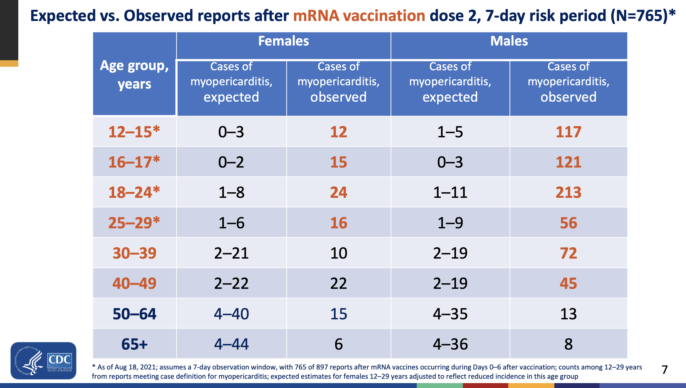
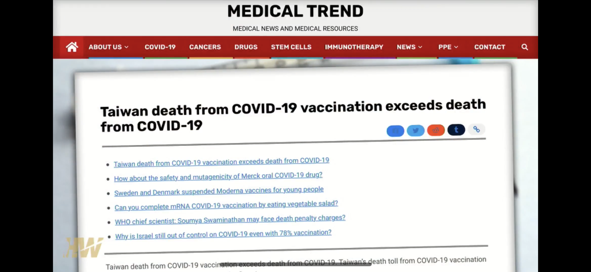
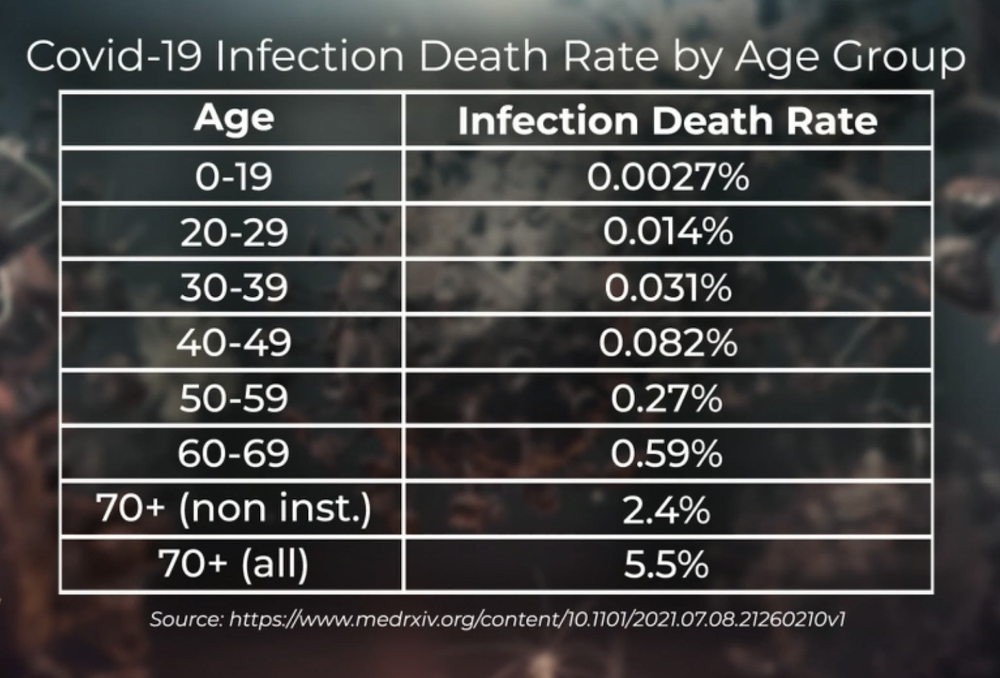
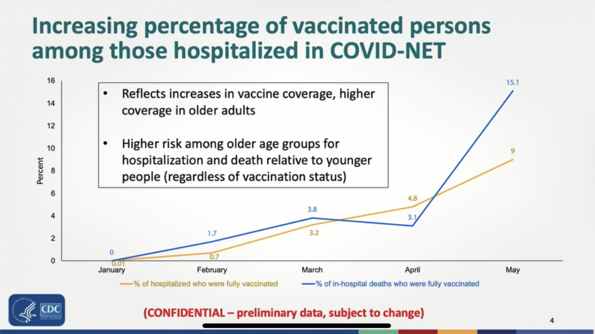
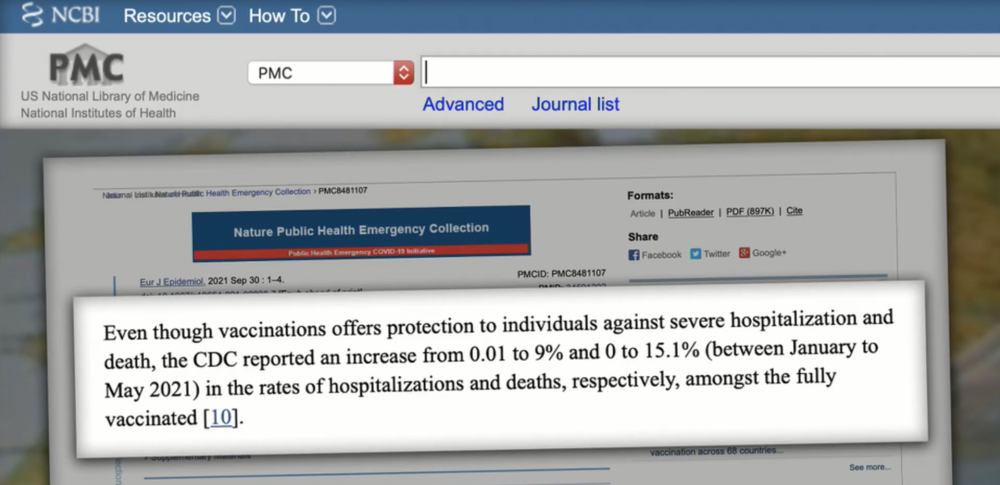
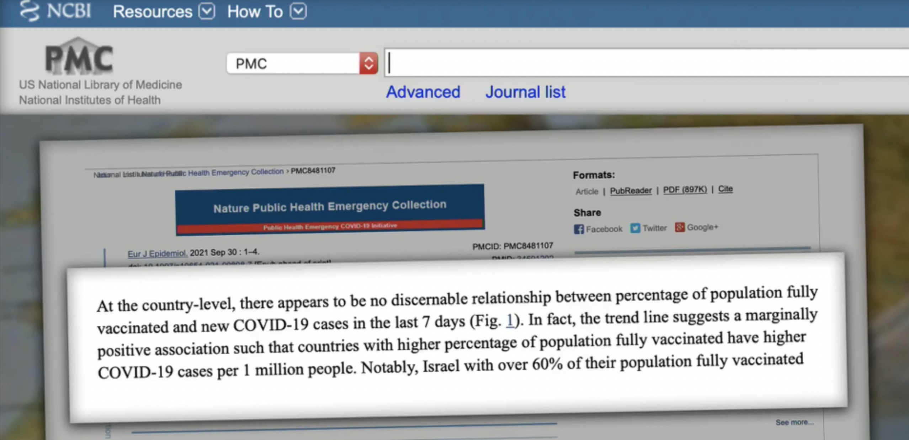
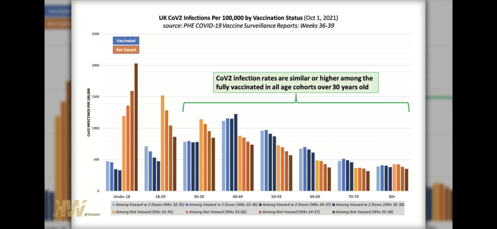
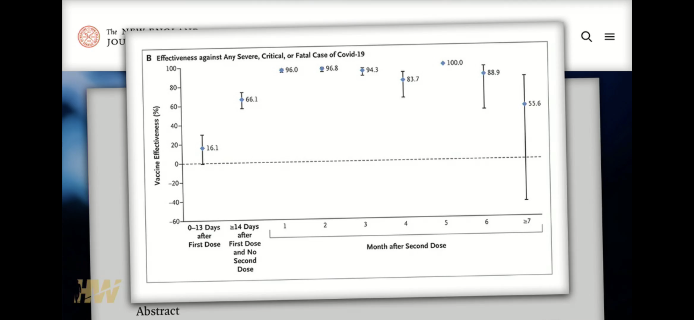
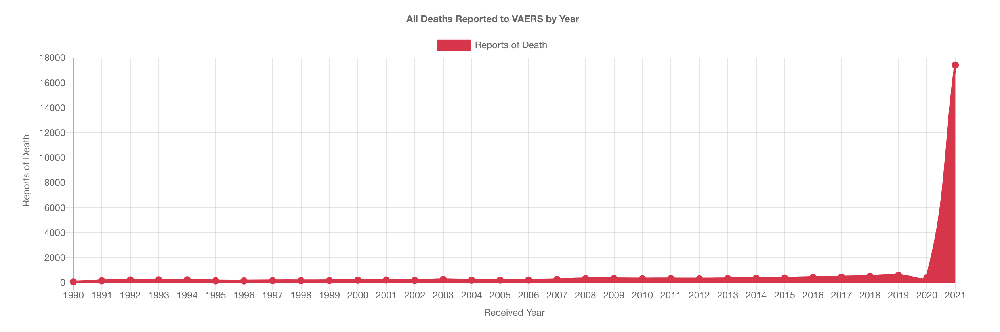
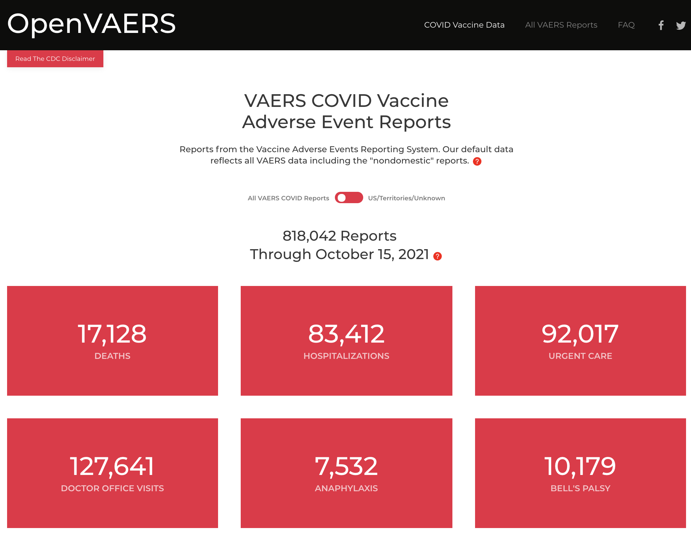

# Humane Concerns 

### COVID-19 Vaccine Related Concerns

> This space is neither a forum for anti-vaxxers nor conspiracy theorists. Only scientific proofs and references to questionable facts are listed below to help us be more aware of COVID-19 pandemic and vaccine effectiveness. 

#### Myopericarditis (Heart Deasese) Risks

Per CDC data as of August 18, 2021, people from 12 to 50 years old are exposed to myopericarditis - the heart desease. Myopericarditis is a condition characterized by inflammation of the pericardium (pericarditis) with concurrent involvement of the adjacent myocardial layer. Myopericarditis usually presents similarly to pericarditis with chest pain, fever, and shortness of breath. Note, that young children are in the highest risks, especially boys, of this heart desease per CDC data.

References: 
- [https://www.cdc.gov/vaccines/acip/meetings/downloads/slides-2021-08-30/03-COVID-Su-508.pdf](https://www.cdc.gov/vaccines/acip/meetings/downloads/slides-2021-08-30/03-COVID-Su-508.pdf)
- [https://en.wikipedia.org/wiki/Myopericarditis](https://en.wikipedia.org/wiki/Myopericarditis)

#### Taiwan suspends 2nd dose Pfizer Covid vaccine for 12-17 ages amid myocarditis cases

Taiwan’s health minister Chen Shih-chung has said that they are suspending administering second doses of the Pfizer-BioNTech (BNT) Covid vaccine to children in the 12-17 age group amid concerns that it may increase the risk of myocarditis.

References: 
- [https://www.msn.com/en-in/news/world/taiwan-suspends-2nd-dose-pfizer-covid-vaccine-for-12-17-ages-amid-myocarditis-cases/ar-AAQD03t](https://www.msn.com/en-in/news/world/taiwan-suspends-2nd-dose-pfizer-covid-vaccine-for-12-17-ages-amid-myocarditis-cases/ar-AAQD03t)

#### Death Rates for Vaccinated vs Unvaccinated

On October 7, 2021, the death toll after vaccination in Taiwan reached 852, while the death toll after the COVID-19 was diagnosed was 844. The number of deaths after vaccination exceeded the number of confirmed deaths for the first time.

References: 
- [https://medicaltrend.org/2021/10/10/taiwan-death-from-covid-19-vaccination-exceeds-death-from-covid-19/](https://medicaltrend.org/2021/10/10/taiwan-death-from-covid-19-vaccination-exceeds-death-from-covid-19/) 

Covid-19 infection death rate is 0.03% for 35 year old. See your age group below. Covid-19 survival rate is 99.99%.

References:
- [https://www.medrxiv.org/content/10.1101/2021.07.08.21260210v1](https://www.medrxiv.org/content/10.1101/2021.07.08.21260210v1)

#### Increased Hospitalizion of Vaccinated

Per CDC, there is an increased percentage of vaccinated pesons among those hospitalized 

Even though vaccinations offers protection to individuals against severe hospitalization and death, the CDC reported an increase from 0.01 to 9% and 0 to 15.1% (between January to May 2021) in the rates of hospitalizations and deaths, respectively, amongst the fully vaccinated.

References: 
- [https://www.ncbi.nlm.nih.gov/pmc/articles/PMC8481107/](https://www.ncbi.nlm.nih.gov/pmc/articles/PMC8481107/)

#### More Covid-19 Cases in Highly Vaccinated Countries

National Institutes of Health states, at the country-level, there appears to be no discernable relationship between percentage of population fully vaccinated and new COVID-19 cases. In fact, the trend line suggests a marginally positive association such that countries with higher percentage of population fully vaccinated have higher COVID-19 cases per 1 million people. Notably, Israel with over 60% of their population fully vaccinated had the highest COVID-19 cases per 1 million people in the last 7 days.

References: 
- [https://www.ncbi.nlm.nih.gov/pmc/articles/PMC8481107/](https://www.ncbi.nlm.nih.gov/pmc/articles/PMC8481107/)

#### Vaccine Effectiveness Concern

Protection against SARS-CoV-2 infection appeared to wane rapidly following its peak after the second dose, but protection against hospitalization and death persisted at a robust level for 6 months after the second dose.

References:
- [https://www.nejm.org/doi/full/10.1056/NEJMoa2114114](https://www.nejm.org/doi/full/10.1056/NEJMoa2114114)

All deaths reported to VAERS by year is significantly increased in 2021

VAERS reports 17K+ Covid vaccine deaths, 83K+ hospitalizations, 92K urgent care visits, 127K+ docttor office visits, etc. as of October 15, 2021. 

References:
- [https://openvaers.com/covid-data](https://openvaers.com/covid-data)

#### Study shows dramatic decline in effectiveness of all three COVID-19 vaccines over time

As the Delta variant became the dominant strain of the coronavirus across the United States, all three COVID-19 vaccines available to Americans lost some of their protective power, with vaccine efficacy among a large group of veterans dropping between 35% and 85%, according to a new study.

References:
- [https://www.latimes.com/science/story/2021-11-04/study-shows-dramatic-decline-in-effectiveness-of-covid-19-vaccines](https://www.latimes.com/science/story/2021-11-04/study-shows-dramatic-decline-in-effectiveness-of-covid-19-vaccines)

#### Meeting of the COVID-19 Giants with Geert Vanden Bossche and Robert Malone MD

Discussion between two stalwarts in the COVID-19 pandemic. Both men have taken an ethical stand to focus on science and not be afraid to share their expertise.

References: 
- [https://www.youtube.com/watch?v=qP31cfD3YOY](https://www.youtube.com/watch?v=qP31cfD3YOY)

#### Florida Summit on COVID

The Florida Summit on COVID included doctors from throughout the U.S. who discussed the vaccines, natural immunity in those who previously had the virus, vaccine mandates and related topics. Some takeaways are:
- Under no circumstances children should be vaccinated. 
  - Children are not in high risk but, if vaccinated, they have higher risks of heart disease - myopericarditis.
- Do not vaccinate those who was sick with COVID-19 virus. 
  - Natural immunity is superior to vaccines and lasts much longer.
- CDC and government should not interfere with doctors' treatments agaist COVID infections. 

References:
- [https://www.youtube.com/watch?v=6OhRNGBmBZw](https://www.youtube.com/watch?v=6OhRNGBmBZw)

### Agenda Behind COVID-19

Thierry Baudet's speech in Dutch parliament about the agenda behind COVID-19 touches multiple points and is a great summary of COVID agenda. 

References:
- [https://www.youtube.com/watch?v=iAxuvTzWJLY](https://www.youtube.com/watch?v=iAxuvTzWJLY)
- [Translated Transcript] [https://ordomedicus.org/thierry-baudets-speech-in-dutch-parliament-about-the-agenda-behind-covid-19/](https://ordomedicus.org/thierry-baudets-speech-in-dutch-parliament-about-the-agenda-behind-covid-19/)
- [Official Transcript] [https://www.fvd.nl/volledige-speech-van-thierry-baudet-bij-de-algemene-politieke-beschouwingen-2021](https://www.fvd.nl/volledige-speech-van-thierry-baudet-bij-de-algemene-politieke-beschouwingen-2021)

### 19 States Sue Biden Administration over COVID Vaccine Rule

Eighteen states filed three separate lawsuits Friday to stop President Joe Biden‘s COVID-19 vaccine mandate for federal contractors, arguing that the requirement violates federal law.

Attorneys general from Alaska, Arkansas, Iowa, Missouri, Montana, Nebraska, New Hampshire, North Dakota, South Dakota and Wyoming signed on to one lawsuit, which was filed in a federal district court in Missouri. Another group of states including Georgia, Alabama, Idaho, Kansas, South Carolina, Utah and West Virginia filed a lawsuit in federal district court in Georgia.

Texas also sued individually on Friday.

References:
- [https://fox8.com/news/coronavirus/10-states-sue-biden-administration-over-covid-vaccine-rule/](https://fox8.com/news/coronavirus/10-states-sue-biden-administration-over-covid-vaccine-rule/)

### Coronavirus (COVID-19) vaccines adverse reactions in UK

A weekly report covering adverse reactions to approved COVID-19 vaccines. For example, COVID-19 mRNA Pfizer-BioNTech Vaccine Analysis Print document shows:
- 12.6K suffering blood disorders with 3 fatal cases
- 7K cardiac disorders with 115 fatal cases
- 34K gastrointestinal disorders with 18 fatal cases
- 92.5K general disorders with 203 fatal cases
- 43.7K muscle & tissue disorders with 2 fatal cases
- 8.7K Infections with 103 fatal cases
- 63.8K nervous system disorders with 62 fatal cases
- 23.9K reproductive & breast disorders with 1 fatal cases
- 16K respiratory disorders with 51 fatal cases

- etc.

References:
- [https://www.gov.uk/government/publications/coronavirus-covid-19-vaccine-adverse-reactions](https://www.gov.uk/government/publications/coronavirus-covid-19-vaccine-adverse-reactions)
- [https://assets.publishing.service.gov.uk/government/uploads/system/uploads/attachment_data/file/1034708/COVID-19_Pfizer-BioNTech_Vaccine_Analysis_Print_DLP_10.11.2021.pdf](https://assets.publishing.service.gov.uk/government/uploads/system/uploads/attachment_data/file/1034708/COVID-19_Pfizer-BioNTech_Vaccine_Analysis_Print_DLP_10.11.2021.pdf)

### At least 69 athletes collapse in one month, many dead

The reports of athletes who suddenly collapse have been increasing noticeably lately. Heart problems such as heart inflammation are often the cause – one of the known life-threatening side effects of Covid vaccines, which even the manufacturers themselves warn against.

References:
- [https://freewestmedia.com/2021/11/26/at-least-69-athletes-collapse-in-one-month-many-dead/](https://freewestmedia.com/2021/11/26/at-least-69-athletes-collapse-in-one-month-many-dead/)

### Legal Fights Against Illegal Vaccine Mandates

Federal Judge Rejects DOD Claim That Pfizer EUA and Comirnaty Vaccines Are ‘Interchangeable’. Under law, everyone has ‘right to refuse’ EUA product

References: 
- [https://childrenshealthdefense.org/defender/judge-allen-winsor-pfizer-eua-comirnaty-vaccines-interchangeable/](https://childrenshealthdefense.org/defender/judge-allen-winsor-pfizer-eua-comirnaty-vaccines-interchangeable/)